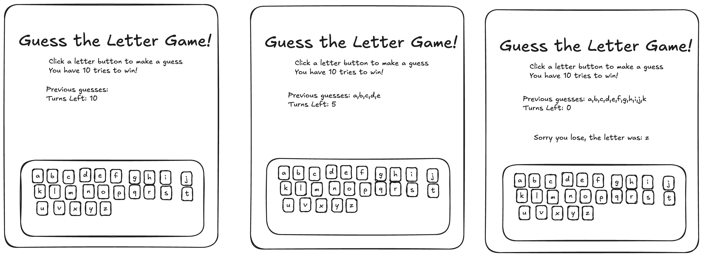

# Guess the Letter Game!

This is a game where a player has to try and guess a letter that is chosen by the computer. The player has 10 tries to win.

### MVP Requirements

- Letter is randomly generated by computer.
- List of letter buttons for player to make a guess
- Player gets 10 tries to guess.
- Displays # of tries
- If 10 tries wrong they lose.
- Displays Win/Lose message
- Display computer letter if player loses game
- Displays player guesses 

#### Extra
- Bonus: restart the game

## User Stories
- As a player I should be able to see a list of letter buttons so I can make a guess
- As a player I should be able to see previous guesses that were wrong.
- As a Player I should be able to see how many turns they have left
- As a Player I should be able to see a win/lose message
- As a player I should see what the letter was if I lose the game

### Things to consider
- make a function that that listens to the button click
- make a function that shows the win/lose message
- have variable to store the letter guesses (list)
- have variable to store the computer guess 
- have function that chooses a random letter from a list of letters 
- have variable to store the # of guesses
- when player takes a turn, think about what has to change ( # of turns, player choice, check the letter?)
- make a function that checks if the letter choses is the right letter 

### Mock-up
The game has 3 views, below is the mockup. This is a rough guide on what your game should look like and where to place items on the page.

